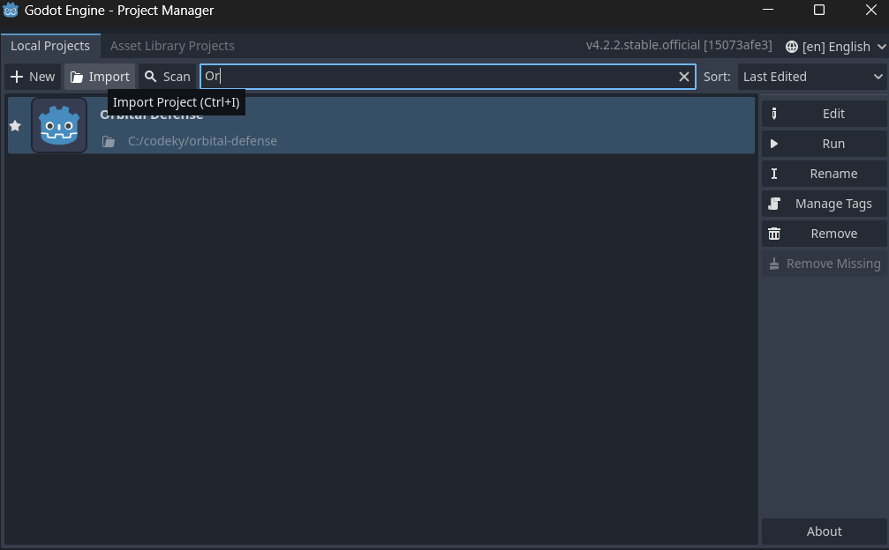
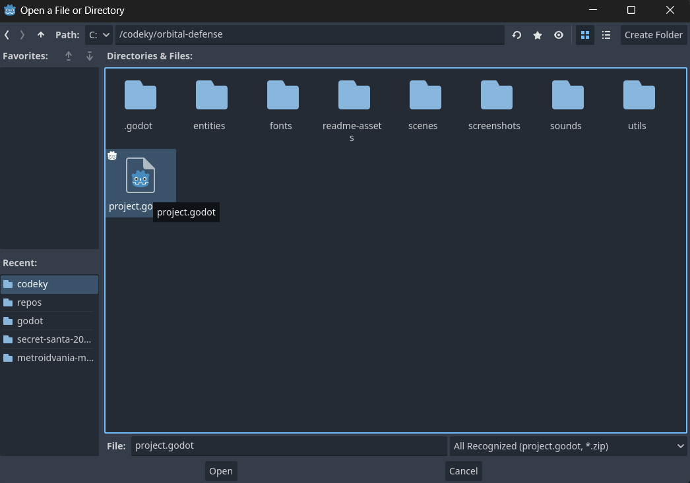

# Orbital Defense
Orbital Defense is a game made with Godot as a stretch goal for my web development project, [Highest of the HI](https://github.com/dan-collins-dev/highest-of-the-hi).

## Technologies Used
| Tools                                                    | Version |
|----------------------------------------------------------|---------|
| [Godot](https://godotengine.org/)                        | `v4.2.2`|
| [Furnace Tracker](https://github.com/tildearrow/furnace) | `v0.6`  |

## Setup
1. Download [Godot v4.2.2](https://godotengine.org/)
2. Open your terminal and run `git clone https://github.com/dan-collins-dev/orbital-defense.git` in the directory of your choice.
3. Open Godot and click the "Import Project" button in the menu.

4. In the project's root directory, open `project.godot`

5. Click "Import and Edit", which will open the project.

6. Press F5 or click the play button.

## Note
Since the game is focused on demonstrating the full functionality of another project, this game can only fully run when Highest of the HI is being served.